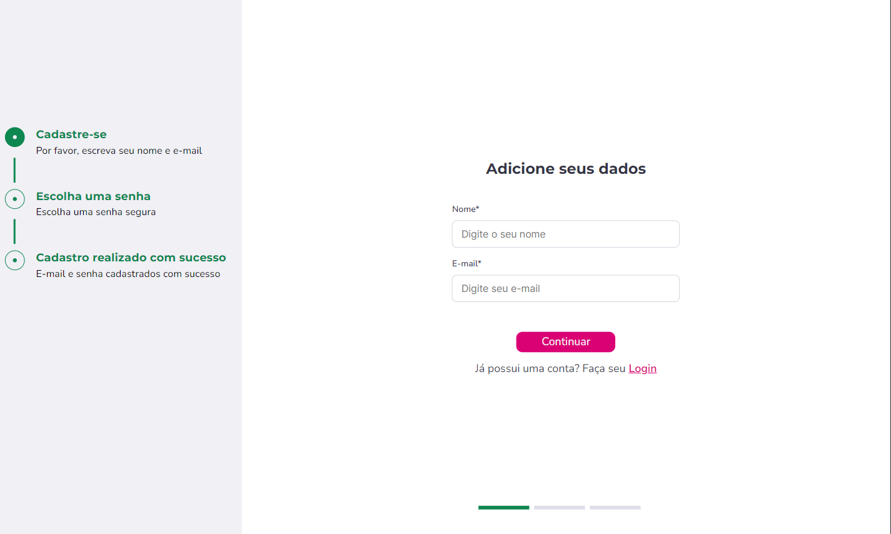
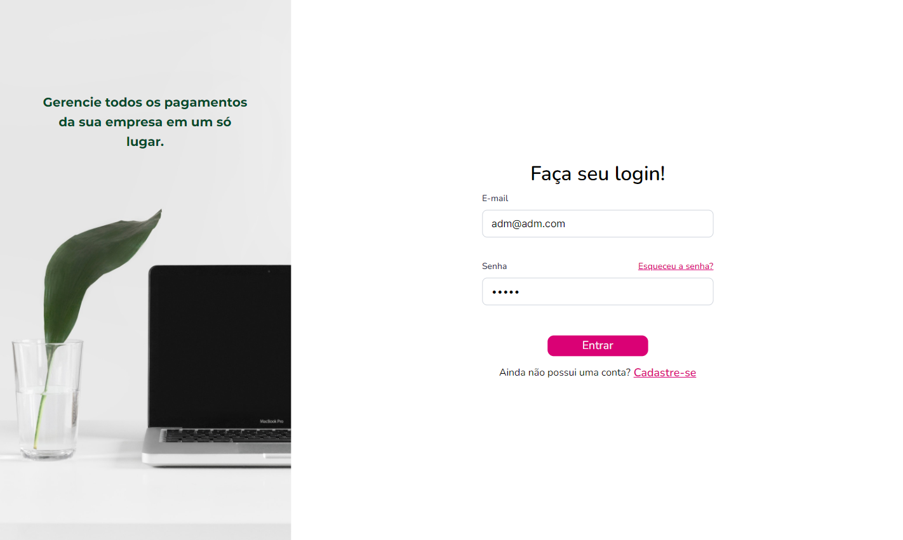
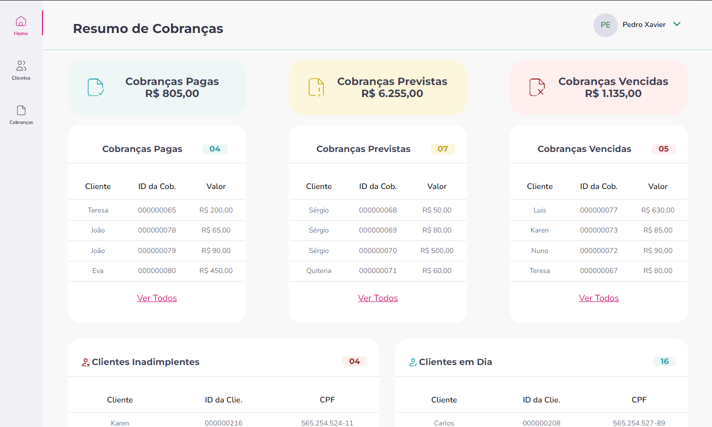
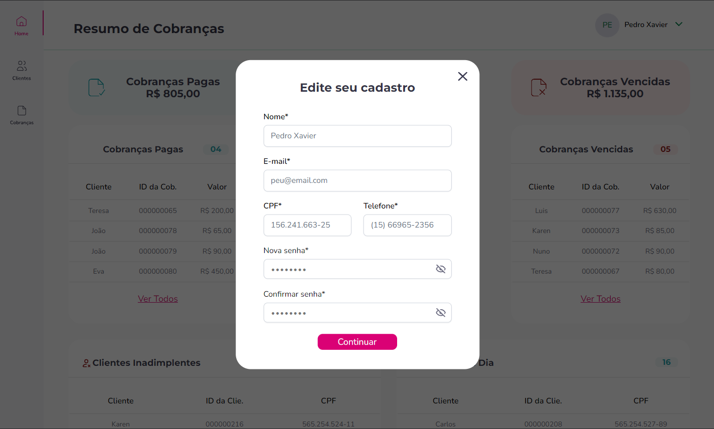
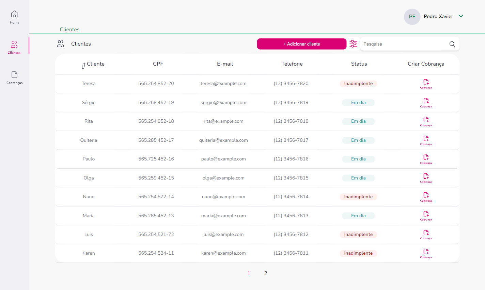
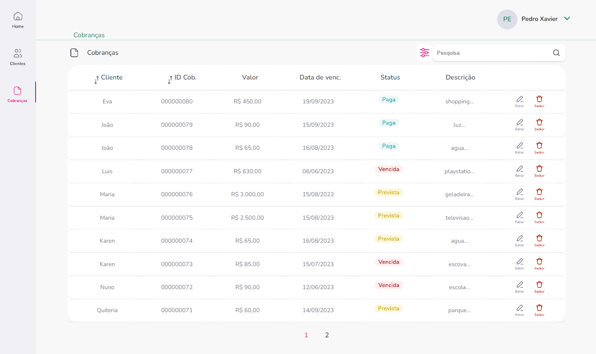
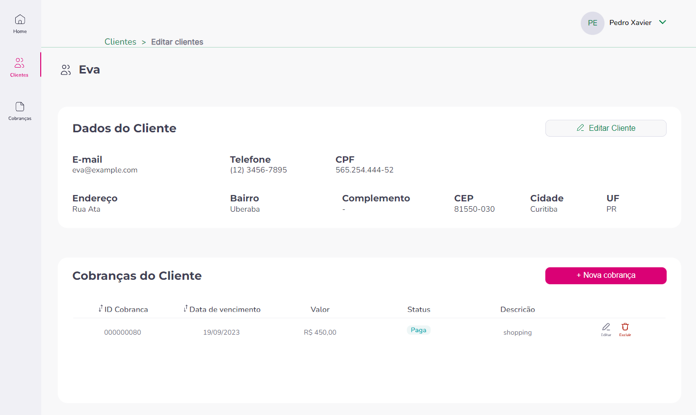

**Repositório de Backend**: (https://github.com/mateusramoscaetano/back-integral-m05-t10)

**Repositório de Frontend**:(https://github.com/mateusramoscaetano/front-integral-m05-t10)

**URL da aplicação funcionando**: (https://effulgent-centaur-c78cd5.netlify.app)

**Pull Request (PR) de Backend**:(https://github.com/cubos-academy/back-integral-m05-t10/pull/18)

**Pull Request (PR) de Frontend**:(https://github.com/cubos-academy/front-integral-m05-t10/pull/15)

---

# Desafio Final Equipe 4 Documentação


Uma aplicação desenvolvida pelos alunos da turma 10 Desenvolvimento de Software da Cubos Academy. Essa aplicação segue um modelo de site onde o usuário (empresa) pode gerenciar as cobranças relacionadas a seus clientes.

## ⚙️ Funcionalidades

- Usuário ( Empresa ):
  - [x]  Cadastrar-se na plataforma
  - [x]   Fazer login na plataforma
  - [x]  Conferir o resumo de suas cobranças
   - [x]  Atualizar seu cadastro
    - [x]  Fazer logout da plataforma
  - [x]  Ações envolvendo seus clientes: 
    - Conferir todos os seus clientes
    - Conferir detalhes de cada clientes
    - Cadastrar um clientes
    - Editar os dados de um cliente
    - Pesquisar clientes pelo nome, email e cpf
  - [x]  Ações envolvendo cobranças
    - Conferir todas as cobranças
    - Conferir detalhes de cada cobranças
    - Cadastrar um cobrança
    -  Editar um cobrança
    - Excluir uma cobrança 
    - Pesquisar cobranças pelo nome e pelo identificador

---

## 🎨 Layout

O layout da aplicação está disponível no Figma:


[Figma ](https://www.figma.com/file/EsX2ltIJ6gSGFzXXCU1pQH/M05-SPRINT-03?node-id=410%3A47347)


### Web

---

</img>

---

</img>

---

</img>

---

</img>

---

</img>

---

</img>

---

</img>

---

## 🛣️ Como executar o projeto

### Pré-requisitos

Antes de começar, você vai precisar ter instalado em sua máquina as seguintes ferramentas:
[Git](https://git-scm.com), [Node.js](https://nodejs.org/en/). 
Além disto é bom ter um editor para trabalhar com o código como [VSCode](https://code.visualstudio.com/)

#### 🧭 Rodando a aplicação web (Frontend)

```bash

# Clone este repositório
$ git clone https://github.com/mateusramoscaetano/front-integral-m05-t10

# Acesse a pasta do projeto no seu terminal/cmd
$ cd front-integral-m05-t10

# Instale as dependências
$ npm install

# Execute a aplicação em modo de desenvolvimento
$ npm run dev

# A aplicação será aberta na porta:5173 - acesse http://localhost:5173

# A api que está aplicação consome está rodando online.

```

## 🛠 Tecnologias

As seguintes ferramentas foram usadas na construção do projeto:

#### **Website**  ([React](https://reactjs.org/))

-   **[React Icons](https://react-icons.github.io/react-icons/)**
-   **[Axios](https://github.com/axios/axios)**
-   **[React-Input-Mask](https://www.npmjs.com/package/react-input-mask)**
-   **[React-toastify](https://www.npmjs.com/package/react-toastify)**


## 💪 Como contribuir para o projeto

1. Faça um **fork** do projeto.
2. Crie uma nova branch com as suas alterações: `git checkout -b my-feature`
3. Salve as alterações e crie uma mensagem de commit contando o que você fez: `git commit -m "feature: My new feature"`
4. Envie as suas alterações: `git push origin my-feature`
> Caso tenha alguma dúvida confira este [guia de como contribuir no GitHub](./CONTRIBUTING.md)
=======


